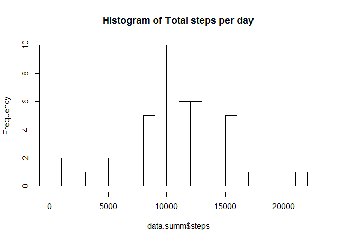
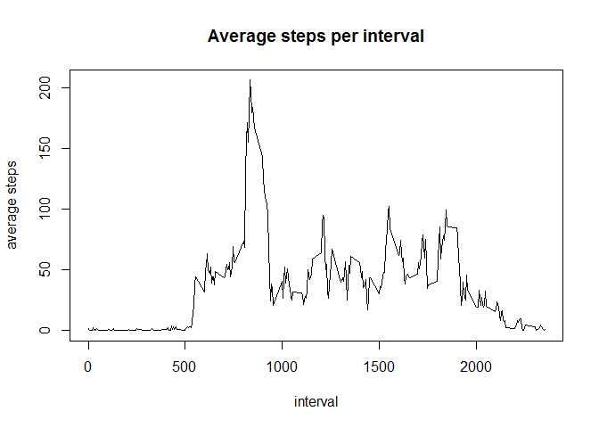
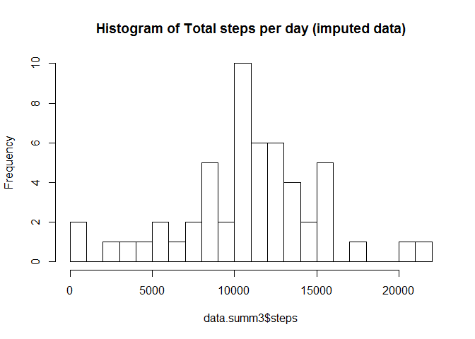
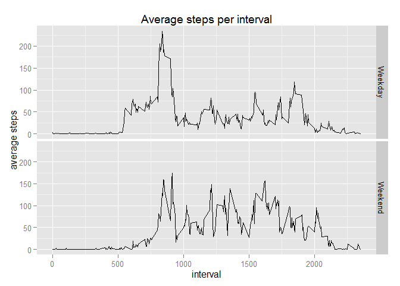

# Reproducible Research: Peer Assessment 1
M.van Heezik

## Loading and preprocessing the data

```r
data<-read.csv("./activity.csv", na="NA")
```

## What is mean total number of steps taken per day?

```r
library(dplyr)
```

```
## 
## Attaching package: 'dplyr'
## 
## The following object is masked from 'package:stats':
## 
##     filter
## 
## The following objects are masked from 'package:base':
## 
##     intersect, setdiff, setequal, union
```

```r
data.summ <-summarise_each(group_by(data, date ), funs(sum))
hist(data.summ$steps,breaks=20,main="Histogram of Total steps per day")
```

 

```r
#mean(data.summ$steps, na.rm = TRUE )
#median(data.summ$steps, na.rm = TRUE )
```
The mean total number of steps taken per day is: 1.0766189\times 10^{4}  
The median total number of steps taken per day is: 10765

## What is the average daily activity pattern?

```r
data.summ2 <-summarise_each(group_by(data[!is.na(data$steps),], interval ), funs(mean))
plot(x=data.summ2$interval, y=data.summ2$steps, type="l",main="Average steps per interval",
     xlab="interval", ylab="average steps")
```

 

```r
data.max<-data.summ2[which.max(data.summ2$steps),]
```

The maximum average steps is 206.1698113 and found at interval 835


## Imputing missing values

```r
data.corrected <- merge(data[is.na(data$steps),c("interval","date")],data.summ[,c("interval","steps")],by="interval")
data.combi<-rbind(data.corrected, data[!is.na(data$steps),])

data.summ3 <-summarise_each(group_by(data.combi, date ), funs(sum))
hist(data.summ3$steps,breaks=20,main="Histogram of Total steps per day (imputed data)")
```

 

There are 2304 missing values in the dataset  
The imputed mean total number of steps taken per day is: 1.0766189\times 10^{4}  
The imputed median total number of steps taken per day is: 10765

The difference in mean total number of steps taken per day is: 0  
The imputed median total number of steps taken per day is: 0  

There is negligible impact of imputing missing values

## Are there differences in activity patterns between weekdays and weekends?

```r
library(ggplot2)
```

```
## Warning: package 'ggplot2' was built under R version 3.1.3
```

```r
data.combi$day<-as.Date(data.combi$date,format = "%Y-%m-%d")
data.combi$weekday<-ifelse(weekdays(data.combi$day) %in% c("zondag","zaterdag"),"Weekend", "Weekday")

data.summ4 <-summarise_each(group_by(data.combi,  weekday, interval ), funs(mean))

qplot(x=data.summ4$interval, y=data.summ4$steps, data=data.summ4, main="Average steps per interval",
     xlab="interval", ylab="average steps", facets=weekday~., geom="line")
```

 
